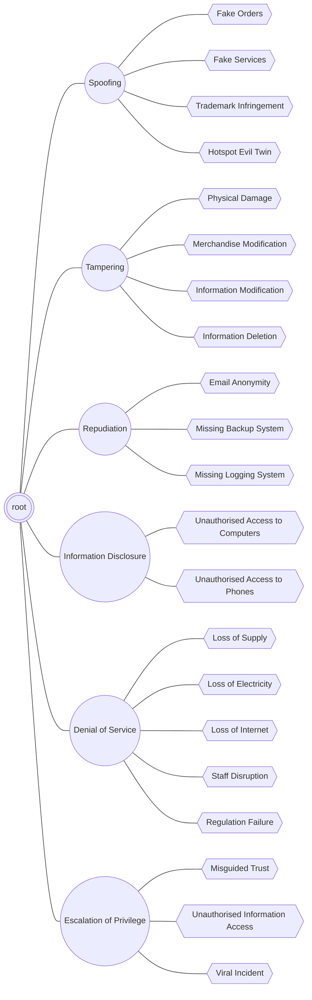

# Attack Tree

```mermaid
graph LR;
  root(((root))) --- Spoofing((Spoofing));
  Spoofing((Spoofing)) --- FakeOrders{{Fake Orders}};
  Spoofing((Spoofing)) --- FakeServices{{Fake Services}};
  Spoofing((Spoofing)) --- TrademarkInfringement{{Trademark Infringement}};
  Spoofing((Spoofing)) --- HotspotEvilTwin{{Hotspot Evil Twin}};
  root(((root))) --- Tampering((Tampering));
  Tampering((Tampering)) --- PhysicalDamage{{Physical Damage}};
  Tampering((Tampering)) --- MerchandiseModification{{Merchandise Modification}};
  Tampering((Tampering)) --- InformationModification{{Information Modification}};
  Tampering((Tampering)) --- InformationDeletion{{Information Deletion}};
  root(((root))) --- Repudiation((Repudiation));
  Repudiation((Repudiation)) --- EmailAnonymity{{Email Anonymity}};
  Repudiation((Repudiation)) --- MissingBackupSystem{{Missing Backup System}};
  Repudiation((Repudiation)) --- MissingLoggingSystem{{Missing Logging System}};
  root(((root))) --- InformationDisclosure((Information Disclosure));
  InformationDisclosure((Information Disclosure)) --- UnauthorisedAccesstoComputers{{Unauthorised Access to Computers}};
  InformationDisclosure((Information Disclosure)) --- UnauthorisedAccesstoPhones{{Unauthorised Access to Phones}};
  root(((root))) --- DenialofService((Denial of Service));
  DenialofService((Denial of Service)) --- LossofSupply{{Loss of Supply}};
  DenialofService((Denial of Service)) --- LossofElectricity{{Loss of Electricity}};
  DenialofService((Denial of Service)) --- LossofInternet{{Loss of Internet}};
  DenialofService((Denial of Service)) --- StaffDisruption{{Staff Disruption}};
  DenialofService((Denial of Service)) --- RegulationFailure{{Regulation Failure}};
  root(((root))) --- EscalationofPrivilege((Escalation of Privilege));
  EscalationofPrivilege((Escalation of Privilege)) --- MisguidedTrust{{Misguided Trust}};
  EscalationofPrivilege((Escalation of Privilege)) --- UnauthorisedInformationAccess{{Unauthorised Information Access}};
  EscalationofPrivilege((Escalation of Privilege)) --- ViralIncident{{Viral Incident}};
```
