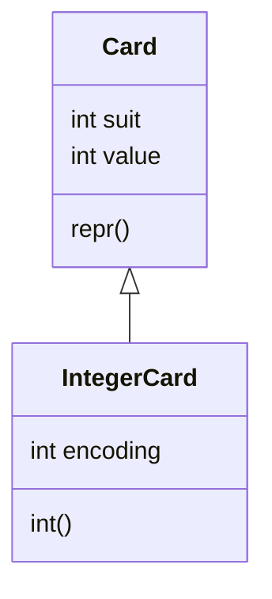

# Class Diagram for Card

```mermaid
classDiagram
    Card <|-- IntegerCard
    class Card{
        int suit
        int value
        repr()
    }
    class IntegerCard{
        int encoding
        int()
    }
```
