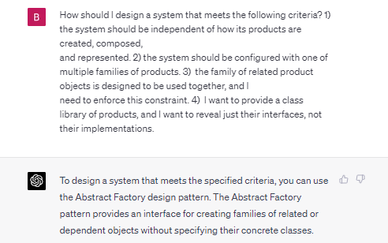
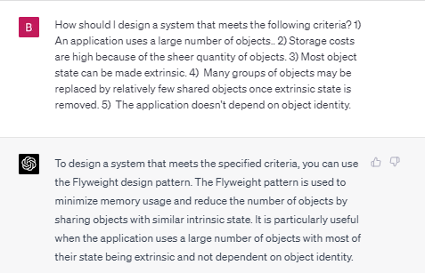
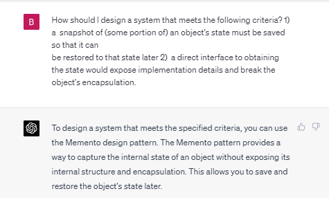

# Design Pattern Recommendations by Chat GPT-4

## Abstract Factory Prompt

## Composite Prompt

## Flyweight Prompt

## Memento Prompt

## Reflection

In every case Chat GPT-4 chose the expected design pattern, and even provided a guide to implementating each design pattern in Python too. That matched my expections, because I assume Chat GPT-4 had academic papers as part of it's training material too. That's not to say Chat GPT-4 should be trusted in any way.

The purpose of this document is to record the vision of using AI as a research tool, without claiming that will ever be possible. For that reason, I think it's best to consider this as a protypical specification of an ideal design pattern recommendation system. There is a need to conduct further research on information reliability in a post-AI era, as with these results, it's likely that AI will be employed for recommendation systems in the future.
