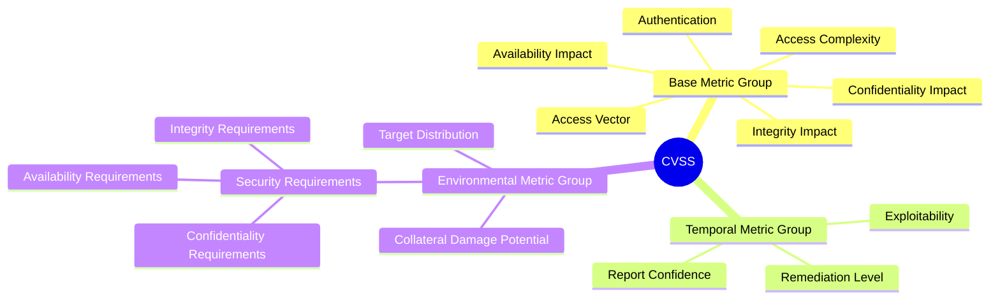

# Common Vulnerability Scoring System

```mermaid
mindmap
    root((CVSS))
        Base Metric Group
            Access Vector
            Access Complexity
            Authentication
            Confidentiality Impact
            Integrity Impact
            Availability Impact
        Temporal Metric Group
            Exploitability
            Remediation Level
            Report Confidence
        Environmental Metric Group
            Collateral Damage Potential
            Target Distribution
            Security Requirements
                Confidentiality Requirements
                Integrity Requirements
                Availability Requirements
```
