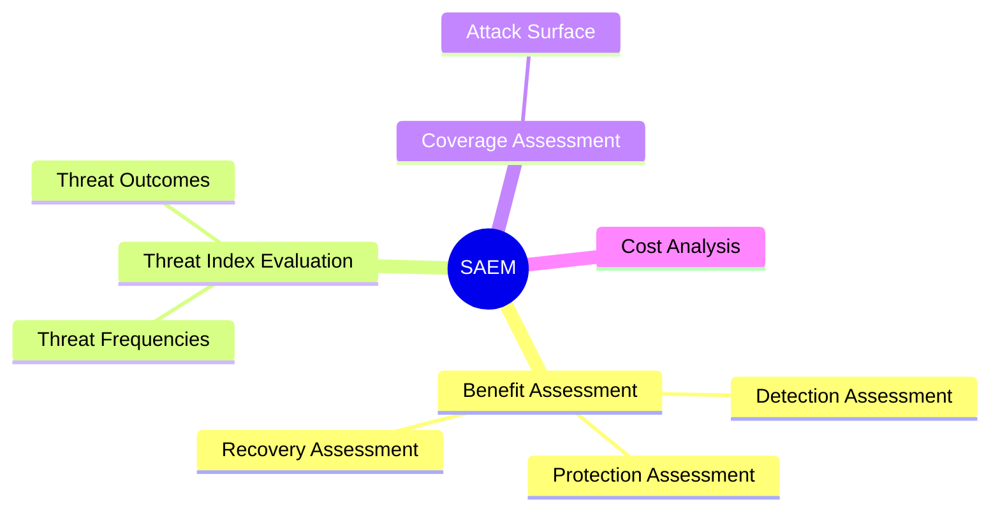

# Security Attribute Evaluation Method

```mermaid
mindmap
    root((SAEM))
        Benefit Assessment
            Protection Assessment
            Detection Assessment
            Recovery Assessment
        Threat Index Evaluation
            Threat Frequencies
            Threat Outcomes
        Coverage Assessment
            Attack Surface
        Cost Analysis
```
